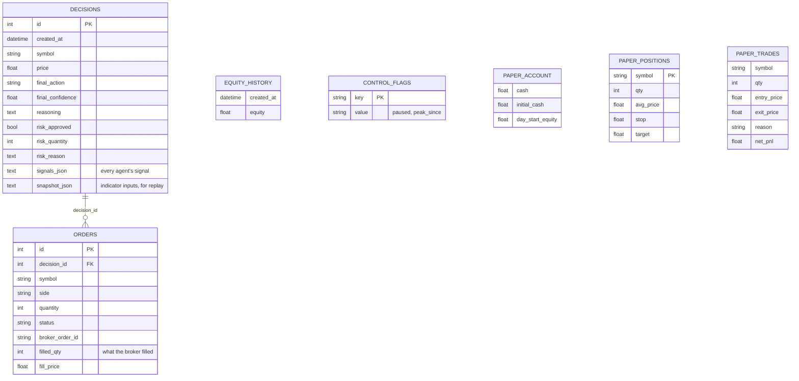
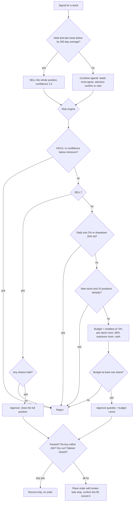

# AI Trading Bot (India / NSE first)

A paper-trading bot: free OpenRouter AI models propose trades, a deterministic risk engine alone decides order size, and
a LangGraph workflow orchestrates everything. **Indian market by default** (NSE, rupees, IST hours, NSE holidays).

> **Status: entry signal unproven. Paper trading / dry run only. Never real money.**
> - 10-year test on Indian stocks: the bot's entry rule earned the same as simply holding the stock universe (+0.2%/yr
>   over an equal-weight basket), before any survivorship correction. **No candidate signal showed a robust edge**
>   (`scripts/research_signals.py`). Survivorship bias alone is worth ~9 points/yr in that data.
> - The original **2%/5% exits were the main problem**: stopped out after a median of 1 day, they lost money in every
>   window tested (-20% over 9 years). A wide protective stop + a rule-based trend exit turned the same entries into
>   +143% (both halves positive), so those are now the defaults. This fixes a defect; it does not validate the entries.
> - US, one year, AI agent with the old exits: ~0%, a 28% win rate that is exactly break-even. Details: `STRATEGY.md`.

## Quick start (Windows)

```
python -m venv venv
venv\Scripts\activate
pip install -r requirements-dev.txt
copy .env.example .env         # put your OPENROUTER_API_KEY in it (India needs nothing else)

python main.py --screen        # scan all ~2,300 NSE stocks, print today's top candidates (~1 min)
python main.py                 # one dry-run cycle: scan + AI + risk check, records decisions, trades nothing
python main.py --loop 30       # repeat every 30 min while NSE is open (dry run)
python main.py --loop 30 --live   # same, but trade in the built-in paper simulator
python main.py --positions     # every open position (P&L, buy date), closed-trade history, overall status
python main.py --intraday [--live]   # intraday breakout engine, own paper account (dry run without --live); backtest lost, see STRATEGY.md
python main.py --intraday-report     # the intraday account's positions, history and status
python main.py --report        # paper account: equity, trades, win rate, fees, exits
python main.py --graph         # print the LangGraph workflows as Mermaid diagrams
python main.py --check         # test keys and connectivity (OpenRouter, broker, Yahoo, Telegram) and exit
python scripts/replay_decision.py --last 5   # what the AI saw and said for recent decisions
python -m pytest               # offline tests (no network, no keys)
```

## How it works

```
CYCLE   open_cycle -> select_universe -> [ analyze_symbol x N in parallel ] -> execute_cycle (one stock at a time)
                                              |
ANALYSIS (per stock)   fetch_data -> agent_technical  \
                                  -> agent_<any other>  }-> collect      all agents run in parallel
DECISION (per stock)   decide -> risk approved? -> execute
```

1. **Universe** (`src/data`): the official NSE EQ-series list (~2,300 stocks) is scanned once a day with plain code:
   drops price < Rs 100, average daily traded value < Rs 10 crore, < 200 days of history, daily volatility > 4%, and
   anything not in an uptrend (price > MA50 > MA200, RSI < 70); ranks the rest by 12-1 month momentum (12-month return skipping the latest month; needs a year of history) and
   keeps the top 15. Stocks you hold are always added so exits are evaluated.
2. **Analysis on completed daily bars only.** The AI prompt is therefore identical all session (and matches the
   backtest), so **AI answers are cached**: after the first cycle, later cycles cost 0 AI calls (measured: 84 s for the
   first cycle including the full-market scan, ~2 s afterwards).
3. **Agents** run in parallel per stock, and stocks run in parallel (`ANALYSIS_WORKERS`). Decisions and orders then run
   one stock at a time in a fixed order, so risk limits always see fresh state.
4. **Risk engine** (`src/engine/risk_engine.py`, plain code): the only source of order size; 5% per stock, 80% total,
   max 10 positions, halt on -2% day / -20% drawdown, min confidence 0.6, long only.
5. **Execution** at the live price with a broker-side protective stop (-15%) and no practical target; a held stock is
   sold by a deterministic **trend exit** when its last completed close falls below its 200-day average. India uses the built-in **paper
   broker** (`src/engine/paper_broker.py`): fills at the live 5-minute price + slippage, models Indian delivery costs
   (STT, stamp duty, exchange, SEBI, GST, DP charge), replays 5-minute bars to trigger stops/targets, stores everything
   in the database. (Indian brokers have no paper-trading sandbox, so this stands in for one.)
6. **Audit + alerts**: every decision (with every agent's signal as JSON), order and equity point is stored in
   `trading.db`; Telegram alerts and `/pause` kill switch.

### Adding another AI agent

An agent is any object with `name`, `role` and `analyze(ctx)` (`src/agents/base.py`). Roles: `lead` (proposes; all leads
must agree) or `advisor` (can only confirm or veto). Register it and the graph grows a parallel node automatically:

```python
class FundamentalsAgent:
    name, role = "fundamentals", "advisor"
    def analyze(self, ctx):                 # ctx.symbol, ctx.snapshot, ctx.headlines()
        return Signal(action="BUY", confidence=0.7, reasoning="...")   # or None to abstain

pipeline.agents["fundamentals"] = FundamentalsAgent()
pipeline.rebuild_graphs()
```
In `main.py`, add it to the `agents` list in `build_pipeline`. No graph or strategy code changes.

## Safeguards (what protects you when something goes wrong)

| Failure | What the bot does |
|---|---|
| A position loses its stop (for example a SELL fails after its stop was cancelled) | Every cycle checks each long position for a working stop; alerts once, waits 3 s, re-checks, then places a protective stop (`AUTO_PROTECT=false` = alert only). A failed SELL triggers the check immediately. |
| An order is accepted but not fully filled | The broker is asked what really filled; the filled quantity and price are stored, and a partial fill raises an alert. |
| Stale or dead data (suspended stock, no volume) | Refused with a clear error for that stock; the scanner drops stocks whose data stops early. |
| A network call hangs | Every Yahoo, OpenRouter and Telegram call has a timeout (30-60 s). |
| A bad key or dead service | `python main.py --check` (also run at every start) tests OpenRouter, the broker, market data and Telegram; a critical failure stops startup with a clear message. |
| All AI models fail | Stocks become HOLD (flagged degraded) and you are alerted. |
| A -20% drawdown halt | Buying stops and you are alerted; it lapses by itself after 30 days (`DRAWDOWN_PAUSE_DAYS`), or after you review, `/rebase` in Telegram restarts the peak measurement (the daily-loss limit is unaffected). |
| Database busy or connection dropped | Connections are pre-checked, and SQLite waits up to 30 s for a lock. |
| You want to know why it did something | Every decision stores each agent's signal and the indicator inputs; `python scripts/replay_decision.py --last 5` shows the exact prompt and re-checks the rules. Logs: `LOG_FORMAT=json` and `LOG_LEVEL` (docker uses JSON). |

## Configuration

`.env` keys and every tunable (with defaults) are documented in `.env.example`. Limits are validated at startup
(a typo like `MAX_POSITION_PCT=5` refuses to start).

## Docker

```
docker compose up -d --build     # India, PAPER trading in the built-in simulator, every 30 min while NSE is open
docker compose logs -f           # what it is doing
docker compose exec trading-bot python main.py --report    # paper account: equity, trades, win rate, fees, exits
docker compose down              # stop (the database volume, and so your paper history, survives)
```
`docker-compose.yml` runs with `--live` (simulated trades in the paper broker, never real money); remove `--live` for
decisions only. **Phase 5 = leave this running for ~4 weeks**, then judge it with the checks below. The image is non-root, contains no
secrets (`.env` is passed at runtime) and has telemetry off. No cloud deployment is set up; any Docker host works.

## Phase 5 checks (after ~4 weeks of paper trading)

Judge with `--report`, and do not move on unless all hold: 50+ closed trades; equity ahead of just holding the Nifty 50
over the same weeks (compare against a Nifty 50 index fund's return); max drawdown under 20%; no unexplained errors in
`docker compose logs`; results in the same ballpark as the backtests (win rate ~30-45%, trend exits doing most of the work).
Expect it to NOT beat the index: the entry signal is unproven. Weeks of paper trading test the plumbing and fills, not the edge.

## Telegram (optional)

Create a bot with @BotFather, message it once from a **private chat**, put `TELEGRAM_BOT_TOKEN` and `TELEGRAM_CHAT_ID`
in `.env`. Alerts for orders, failures, risk halts, AI outages, scan failures; commands `/status /positions /pause /resume /rebase` work only from that chat. Tested against a mocked Telegram API only.

## Backtests

- `scripts/research_signals.py` - **10-year, multi-regime signal research** (Nifty 500, Indian costs, next-day execution,
  held-out final 3 years, pass/fail rules fixed in the file before any result, real-index survivorship check).
  Six candidates: 12-1 momentum, low volatility, Donchian breakout, RSI(2) dips, the bot's trend rule, index timing.
- `scripts/backtest_india_rule.py --index 50 --years 10 --lookback 2200 --exits` - exit-style comparison with first/second
  half results and a trade-level failure analysis (by exit reason, holding period, year, symbol).
- `scripts/run_backtest.py` (real AI calls, slow, resumable, cache auto-invalidates when the prompt changes),
  `scripts/backtest_sensitivity.py`. The research engine (`src/research/`) is lookahead-free by construction and tested.

## Architecture diagrams

Workflows: `python main.py --graph`. Database and the risk decision below.





## Troubleshooting

| Symptom | Cause and fix |
|---|---|
| `Missing in .env: ...` | Add the named keys to `.env` (see `.env.example`). India needs only `OPENROUTER_API_KEY`. |
| `python main.py --check` shows FAIL for OpenRouter | The key is wrong or revoked (401). Create a new key at openrouter.ai/settings/keys. |
| `market closed; waiting` | Normal outside NSE hours (Mon-Fri 09:15-15:30 IST, minus exchange holidays). |
| Every stock is HOLD and you got "LLM UNAVAILABLE" | All free models failed (overloaded or withdrawn). Wait, or set `OPENROUTER_MODEL` / `OPENROUTER_FALLBACK_MODEL` to models still listed as free on openrouter.ai/models. |
| `UNPROTECTED POSITION` alert | A position has no stop. With `AUTO_PROTECT=true` the bot places one; otherwise close or protect it manually. |
| `RISK HALT: drawdown ...` | Equity fell 20% from its peak. Buys stay blocked for `DRAWDOWN_PAUSE_DAYS` (30) and then resume with a rebased peak; or send `/rebase` in Telegram to restart the measurement now. |
| Telegram silent | Send `/start` to your bot from a private chat; check `TELEGRAM_CHAT_ID` is that chat's id; make sure **only one** program uses the bot token (two pollers steal each other's messages). |
| Yahoo `429` / "Crumb" warnings | Yahoo rate-limiting; harmless, the request is retried. |
| A stock shows `ERROR ... stale` | Its last bar is old or shows no trading (suspended). It is skipped on purpose. |
| Rupee sign shows as `?` on Windows | Run with `PYTHONIOENCODING=utf-8` (the code already sets UTF-8 for its own output). |
| Container keeps restarting | `docker compose logs`: usually a startup check failing (key, network). Fix and `docker compose up -d`. |
| Start the paper account over | `docker compose down -v` deletes the database volume (and all paper history). |
| Old database after an update | Missing columns are added automatically; to start clean delete `trading.db`. |

## Known limitations

- **No demonstrated entry edge** (see status). Every historical test uses today's index members, which inflates results
  (~9 points/yr measured); the AI agent itself has never been tested on Indian stocks (the plain rule stands in for it).
- The -20% drawdown halt lapses after `DRAWDOWN_PAUSE_DAYS` (30) days, when the peak is rebased; set it to 0 for the old behaviour where only recovery or `/rebase` ends it.
- **India has no news sentiment** (no reliable free source: Yahoo returned other companies' articles). Technical agent only.
- **The paper broker is optimistic**: stops fill at the stop price, no circuit-limit modelling (a stock locked at its
  lower circuit may not let you exit), fixed 0.05% slippage, cost rates are approximations and change.
- **No real Indian broker integration.** Automated real-money trading in India is subject to SEBI/exchange rules and
  your broker's requirements; check the current rules before ever attempting it.
- The universe scan and the AI answer cache live in memory per process (a restart re-scans and re-asks once).
- Free OpenRouter models are rate-limited and get withdrawn; an all-models outage makes the bot hold and alerts you.
- **Phase 5 (weeks of paper trading) was started** (see Docker) and needs ~4 weeks to judge. **Phase 6 (real money) is
  deliberately not built and not advised**: the entry signal is unproven, there is no Indian broker integration, and
  real-money automated trading in India is regulated.

## Scripts

`scripts/test_yfinance.py`, `scripts/test_openrouter_api.py` (real calls, safe).

## Project layout

```
main.py                 argument parsing and the swing bot's wiring (build_pipeline, preflight)
src/app/                kit.py (market kit, paper-broker factory), reports.py (--report/--positions/--screen/--graph), intraday_cli.py
src/agents/, llm.py     AI agents and the OpenRouter client (cached, with model fallback)
src/data/               NSE list, Yahoo data, indicators, universe scanner, market clock
src/engine/             risk engine, strategy (agent combination), paper broker
src/intraday/           opening-range-breakout strategy (pure functions) and the 5-minute engine
src/monitoring/         Telegram alerts and commands
src/research/           research engine, candidate signals, NSE delivery-% data
scripts/                backtests, research, start_bots.sh (idempotent starter, also run at reboot by cron)
logs/                   bot.log, intraday.log (git-ignored)
```
