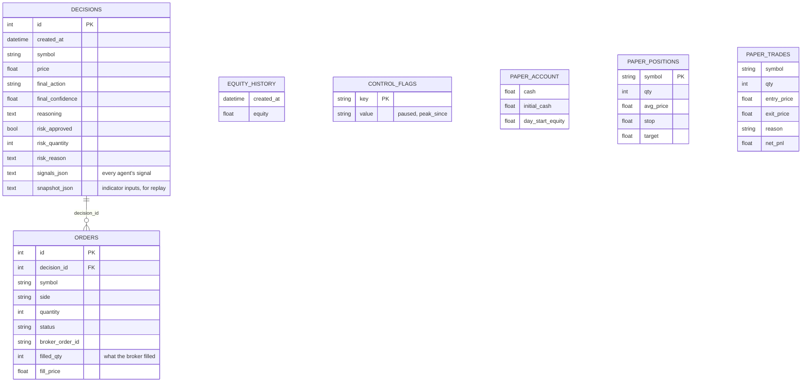
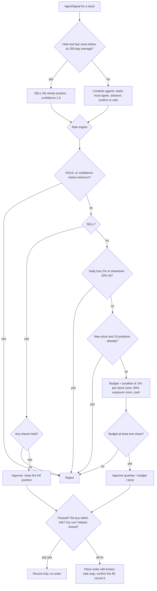

# AI Trading Bot (India / NSE first)

A paper-trading bot: free OpenRouter AI models propose trades, a deterministic risk engine alone decides order size, and
a LangGraph workflow orchestrates everything. **Indian market by default** (NSE, rupees, IST hours, NSE holidays).

> **Status: entry signal unproven. Paper trading / dry run only. Never real money.**
> - 10-year test on Indian stocks: the bot's entry rule earned the same as simply holding the stock universe (+0.2%/yr
>   over an equal-weight basket), before any survivorship correction. **No candidate signal showed a robust edge**
>   (`scripts/research_signals.py`). Survivorship bias alone is worth ~9 points/yr in that data.
> - The original **2%/5% exits were the main problem**: stopped out after a median of 1 day, they lost money in every
>   window tested (-20% over 9 years). A wide protective stop + a rule-based trend exit turned the same entries into
>   +143% (both halves positive), so those are now the defaults. This fixes a defect; it does not validate the entries.
> - US, one year, AI agent with the old exits: ~0%, a 28% win rate that is exactly break-even. Details: `STRATEGY.md`.

## Quick start (Windows)

```
python -m venv venv
venv\Scripts\activate
pip install -r requirements-dev.txt
copy .env.example .env         # put your OPENROUTER_API_KEY in it (India needs nothing else)

python main.py --screen        # scan all ~2,300 NSE stocks, print today's top candidates (~1 min)
python main.py                 # one dry-run cycle: scan + AI + risk check, records decisions, trades nothing
python main.py --loop 30       # repeat every 30 min while NSE is open (dry run)
python main.py --loop 30 --live   # same, but trade in the built-in paper simulator
python main.py --positions     # every open position (P&L, buy date), closed-trade history, overall status
python main.py --intraday [--live]   # intraday breakout engine, own paper account (dry run without --live); backtest lost, see STRATEGY.md
python main.py --intraday-report     # the intraday account's positions, history and status
python main.py --report        # paper account: equity, trades, win rate, fees, exits
python main.py --graph         # print the LangGraph workflows as Mermaid diagrams
python main.py --check         # test keys and connectivity (OpenRouter, broker, Yahoo, Telegram) and exit
python scripts/replay_decision.py --last 5   # what the AI saw and said for recent decisions
python -m pytest               # offline tests (no network, no keys)
```

## Files you download (optional)

NSE's terms of use (nseindia.com and niftyindices.com, read 2026-09-26) prohibit "systematic or automated data
collection" without written consent, so the bot never downloads from those sites. **Nothing here is required**: the
stock list comes from Yahoo Finance automatically, like every price. Files saved by hand into `nse_files`
(`NSE_FILES_DIR`, git-ignored), keeping NSE's file names, are used when present:

| File | From | Used for |
|---|---|---|
| `EQUITY_L.csv` | nseindia.com, Market Data, "Securities available for trading", equity segment | NSE's own stock list instead of Yahoo's |
| `ind_nifty500list.csv`, `ind_nifty100list.csv`, `ind_nifty50list.csv` | niftyindices.com, the index's page, index constituents | research scripts; the intraday universe (else the 100 most-traded stocks, from Yahoo); a last-resort stock list |
| `bhavcopy/sec_bhavdata_full_DDMMYYYY.csv` | nseindia.com, All Reports, "Full Bhavcopy and Security Deliverable data" | the delivery filter (`DELIVERY_FILTER=true`, off by default): needs a file each trading day and switches itself off when the newest is over 7 days old |

NSE's terms also say its data may not be used "for any gaming, virtual trading or simulation activities": that concerns
this paper-trading bot as a whole, and only a licensed data source or NSE's written permission settles it (STRATEGY.md).

## How it works

```
CYCLE   open_cycle -> select_universe -> [ analyze_symbol x N in parallel ] -> execute_cycle (one stock at a time)
                                              |
ANALYSIS (per stock)   fetch_data -> agent_technical  \
                                  -> agent_<any other>  }-> collect      all agents run in parallel
DECISION (per stock)   decide -> risk approved? -> execute
```

1. **Universe** (`src/data`): the official NSE EQ-series list (~2,300 stocks) is scanned once a day with plain code:
   drops price < Rs 100, average daily traded value < Rs 10 crore, < 200 days of history, daily volatility > 4%, and
   anything not in an uptrend (price > MA50 > MA200, RSI < 70); ranks the rest by 12-1 month momentum (12-month return skipping the latest month; needs a year of history) and
   keeps the top 15. Stocks you hold are always added so exits are evaluated.
2. **Analysis on completed daily bars only.** The AI prompt is therefore identical all session (and matches the
   backtest), so **AI answers are cached**: after the first cycle, later cycles cost 0 AI calls (measured: 84 s for the
   first cycle including the full-market scan, ~2 s afterwards).
3. **Agents** run in parallel per stock, and stocks run in parallel (`ANALYSIS_WORKERS`). Decisions and orders then run
   one stock at a time in a fixed order, so risk limits always see fresh state.
4. **Risk engine** (`src/engine/risk_engine.py`, plain code): the only source of order size; 5% per stock, 80% total,
   max 10 positions, halt on -2% day / -20% drawdown, min confidence 0.6, long only.
5. **Execution** at the live price with a broker-side protective stop (-15%) and no practical target; a held stock is
   sold by a deterministic **trend exit** when its last completed close falls below its 200-day average. India uses the built-in **paper
   broker** (`src/engine/paper_broker.py`): fills at the live 5-minute price + slippage, models Indian delivery costs
   (STT, stamp duty, exchange, SEBI, GST, DP charge), replays 5-minute bars to trigger stops/targets, stores everything
   in the database. (Indian brokers have no paper-trading sandbox, so this stands in for one.)
6. **Audit + alerts**: every decision (with every agent's signal as JSON), order and equity point is stored in
   `trading.db`; Telegram alerts and `/pause` kill switch.

### Adding another AI agent

An agent is any object with `name`, `role` and `analyze(ctx)` (`src/agents/base.py`). Roles: `lead` (proposes; all leads
must agree) or `advisor` (can only confirm or veto). Register it and the graph grows a parallel node automatically:

```python
class FundamentalsAgent:
    name, role = "fundamentals", "advisor"
    def analyze(self, ctx):                 # ctx.symbol, ctx.snapshot, ctx.market()
        return AgentSignal(action="BUY", confidence=0.7, reasoning="...")   # or None to abstain

pipeline.agents["fundamentals"] = FundamentalsAgent()
pipeline.rebuild_graphs()
```
In `main.py`, add it to the `agents` list in `build_pipeline`. No graph or strategy code changes.

## Safeguards (what protects you when something goes wrong)

| Failure | What the bot does |
|---|---|
| A position loses its stop (for example a SELL fails after its stop was cancelled) | Every cycle checks each long position for a working stop; alerts once, waits 3 s, re-checks, then places a protective stop (`AUTO_PROTECT=false` = alert only). A failed SELL triggers the check immediately. |
| An order is accepted but not fully filled | The broker is asked what really filled; the filled quantity and price are stored, and a partial fill raises an alert. |
| Stale or dead data (suspended stock, no volume) | Refused with a clear error for that stock; the scanner drops stocks whose data stops early. |
| A network call hangs | Every Yahoo, OpenRouter and Telegram call has a timeout (30-60 s). |
| A bad key or dead service | `python main.py --check` (also run at every start) tests OpenRouter, the broker, market data and Telegram; a critical failure stops startup with a clear message. |
| All AI models fail | Stocks become HOLD (flagged degraded) and you are alerted. |
| A -20% drawdown halt | Buying stops and you are alerted; it lapses by itself after 30 days (`DRAWDOWN_PAUSE_DAYS`), or after you review, `/rebase` in Telegram restarts the peak measurement (the daily-loss limit is unaffected). |
| Database busy or connection dropped | Connections are pre-checked, and SQLite waits up to 30 s for a lock. |
| You want to know why it did something | Every decision stores each agent's signal and the indicator inputs; `python scripts/replay_decision.py --last 5` shows the exact prompt and re-checks the rules. Logs: `LOG_FORMAT=json` and `LOG_LEVEL` (docker uses JSON). |

## Working with free AI models
The free OpenRouter models are reasoning models: hidden "thinking" eats the token budget, upstreams are often overloaded, and
answers can arrive empty, cut off or wrapped in prose. `src/llm/` handles this instead of hoping:
- **Reasoning is switched off** (`LLM_REASONING_OFF=true`): valid answers 3-10x faster; the prompt already reasons step by step in the JSON.
- **Every failure is classified**: overloaded/rate-limited/empty -> backoff and retry (honouring Retry-After); cut off at the
  token limit -> retry with double the budget; malformed or blank JSON -> retry once telling the model what was wrong;
  missing model -> skipped for the session.
- **Tolerant parsing** of fenced or prose-wrapped JSON, and **semantic validation** (no blank reasoning, at least one real risk);
  `rule_alignment` is computed from the data, not taken from the model.
- **Model health**: a model that fails three calls in a row is benched for 5 minutes so the healthy one answers first.
  Requests are paced (`LLM_MIN_INTERVAL`, `LLM_CONCURRENCY`) to stay under the free tier's limit.
- **Fallback ladder**: full chain-of-thought -> compact one-sentence prompt (recorded as `tier: compact`) -> HOLD. A skipped
  reflection/learning/context step is recorded in the decision (`reflection_skipped`, ...).
- **Visibility**: one `LLM health:` log line per cycle (calls ok, average seconds, failures by kind, benched models).

## Configuration

`.env` keys and every tunable (with defaults) are documented in `.env.example`. Limits are validated at startup
(a typo like `MAX_POSITION_PCT=5` refuses to start).

## Docker

```
docker compose up -d --build     # India, PAPER trading in the built-in simulator, every 30 min while NSE is open
docker compose logs -f           # what it is doing
docker compose exec trading-bot python main.py --report    # paper account: equity, trades, win rate, fees, exits
docker compose down              # stop (the database volume, and so your paper history, survives)
```
`docker-compose.yml` runs with `--live` (simulated trades in the paper broker, never real money); remove `--live` for
decisions only. **Phase 5 = leave this running for ~4 weeks**, then judge it with the checks below. The image is non-root, contains no
secrets (`.env` is passed at runtime) and has telemetry off. Any Docker host works.

### AWS deployment (paper bot + the real-portfolio agent, running 24/7)

```
aws configure          # or `aws sso login`; your keys never pass through this repo or an AI assistant
./deploy/deploy.sh      # provisions one EC2 instance (Mumbai, t3.small, a static IP) and deploys this checkout to it
```
One image (`Dockerfile.aws`) runs both: the paper bot, and — since `/portfolio` is wired into the same Telegram
listener — the read-only agent for your real Integrated account, with Chromium included. Two things differ from the
Windows setup: `PORTFOLIO_SECRET_BACKEND=aws` puts your mobile/MPIN in one AWS Secrets Manager secret (KMS-encrypted;
the instance's IAM role can only read/write that one secret — see `deploy/ec2-secrets-policy.json`), since there is no
Windows Credential Manager on Linux; and `PORTFOLIO_NO_SANDBOX=true` swaps Chromium's own OS sandbox for Docker's
container isolation (a container does not have the capability that sandbox needs). Nothing else about the agent
changes: still read-only, still asks for the OTP on Telegram, still never places an order.

`deploy.sh` is idempotent (re-running it updates the running instance rather than making a new one) and opens SSH
(port 22) only from the IP you ran it from — nothing else is exposed; the bot only ever makes outbound calls. The first
run prints a one-time command to save your Integrated login into Secrets Manager (`python -m src.portfolio setup`,
run on the instance, same as the local flow) — the mobile/MPIN never travels through this script or through git.

## Phase 5 checks (after ~4 weeks of paper trading)

Judge with `--report`, and do not move on unless all hold: 50+ closed trades; equity ahead of just holding the Nifty 50
over the same weeks (compare against a Nifty 50 index fund's return); max drawdown under 20%; no unexplained errors in
`docker compose logs`; results in the same ballpark as the backtests (win rate ~30-45%, trend exits doing most of the work).
Expect it to NOT beat the index: the entry signal is unproven. Weeks of paper trading test the plumbing and fills, not the edge.

## Telegram (optional)

Create a bot with @BotFather, message it once from a **private chat**, put `TELEGRAM_BOT_TOKEN` and `TELEGRAM_CHAT_ID`
in `.env`. Alerts for orders, failures, risk halts, AI outages, scan failures; commands `/status /positions /pause /resume /rebase` work only from that chat. Tested against a mocked Telegram API only.

## Real portfolio (read-only, Integrated India)

A separate LangGraph agent that logs in to the Integrated web portal, reads what it shows, analyses it, and logs out:

    fetch (login, OTP on Telegram, read pages, logout) -> extract holdings -> analyse -> AI note -> report

It **never places, modifies or cancels orders and never moves money**: after login it only opens a fixed list of read
pages by address, clicks nothing, and a network guard aborts any request that looks like a transaction (order, sell,
payout, pledge, redeem, ...). It imports none of the trading code; only `src/app/portfolio_agent.py` wires it in.

- **Secrets** (mobile number, MPIN, customer ID) live only in Windows Credential Manager, not in `.env`, files, logs or git.
- **OTP** through the **same Telegram bot** as the trading bot. Send `/portfolio` to the running bot; it asks for the
  OTP, and its listener hands your 4-digit reply to the agent and deletes it from the chat. Only your chat counts, only
  within 3 minutes; reply `cancel` to abort. When the trading bot is not running, `python main.py --portfolio` polls the
  bot itself (do not use it while the trading bot runs: one bot can have only one reader; it stops and says so).
- **One attempt per run.** A wrong OTP stops the run; a failed MPIN step blocks further runs until you run `setup`
  again, so a scheduled run can never lock the account.
- **Numbers are deterministic**: holdings are read from the page's tables/data, and weights, concentration and loss flags
  are plain arithmetic. The free AI model only writes a short note from **symbols, weights and returns**: no
  quantities, amounts, names or account IDs, and it is told not to recommend trades.
- **Step-by-step on Telegram**: OTP submitted, MPIN entered, logged in, each page read (and any write request the page
  tried that the guard blocked), logged out, then the report.
- **The report** comes as separate, formatted Telegram messages (bold headers, bold key figures) — each opens and
  closes its own formatting, so a long section splitting across several messages never leaves a tag half-open:
  1. **Summary:** value, cost, unrealised and booked P&L, dividends over the last 12 months, cash, market-cap mix,
     best and weakest stock.
  2. **Every holding**, as its own card: 🟢/🔴 return marker, shares, average buy price, price now, cost → value,
     P&L, weight, and history (bought, sold, booked profit, dividends).
  3. **Analysis:** gainers, weakest, concentration, sectors, market caps, flags — always followed by a line making
     clear the flags are informational only; this agent never recommends or places a trade.
  4. **Income and tax:** each dividend, this year's sales, short-term lots with the days until they turn long-term,
     and recent transactions. Mergers and demergers are labelled as such, not as trades.
  5. **The AI note:** it is checked, and dropped if it is an error, a complaint or trading advice.
  6. **The run:** pages and tabs read, what the guard stopped (in plain words), logout, time taken, where the files
     are, and — always — a "👉 Next:" line saying exactly what (if anything) you need to do now.

  Progress messages during login are numbered ("Step 3/5 — OTP submitted..."), so you always know where a run stands.
  A failed run states why in plain language and what to do about it (retry, re-run setup, log out yourself, ...).
  Every stock, sector or note that came from the portal or the AI is HTML-escaped before being sent, so a name like
  "Balmer Lawrie & Company Ltd" can never break the formatting or the message.

  Numbers come from the portal's own statements (Portfolio/Present, HoldingsTurnings, Dividend, RealizedGainLoss,
  StatementOfTransaction), read field by field in `src/portfolio/statements.py`.
- **Everything read stays on this PC** under `portfolio_data/` (git-ignored); the plain-text copy saved there
  (`report.txt`) has the formatting tags stripped back out, so it reads cleanly in a text editor too.

```
pip install -r requirements-portfolio.txt && python -m playwright install chromium   # already done on this PC
python -m src.portfolio setup              # mobile, MPIN, customer ID -> Windows Credential Manager
python -m src.portfolio check              # what is stored, masked
/portfolio                                 # on Telegram, while the trading bot runs
python main.py --portfolio --show          # or: without the trading bot (--otp-from terminal, --no-ai)
python -m src.portfolio forget [--profile]  # delete the stored details (and the browser profile)
```

Tested against a local fake of the portal (`tests/test_portfolio_portal.py`) that reproduces the portal's page flow and
element IDs, with a planted order request the guard must stop. Also run and verified against the real account: login,
every page and tab, the guard blocking the portal's own automatic requests, and a correct read of real holdings,
dividends, sales and lots.

## Backtests

- `scripts/research_signals.py` - **10-year, multi-regime signal research** (Nifty 500, Indian costs, next-day execution,
  held-out final 3 years, pass/fail rules fixed in the file before any result, real-index survivorship check).
  Six candidates: 12-1 momentum, low volatility, Donchian breakout, RSI(2) dips, the bot's trend rule, index timing.
- `scripts/backtest_india_rule.py --index 50 --years 10 --lookback 2200 --exits` - exit-style comparison with first/second
  half results and a trade-level failure analysis (by exit reason, holding period, year, symbol).
- `scripts/run_backtest.py` (real AI calls, slow, resumable, cache auto-invalidates when the prompt changes),
  `scripts/backtest_sensitivity.py`. The research engine (`src/research/`) is lookahead-free by construction and tested.

## Architecture diagrams

Workflows: `python main.py --graph`. Database and the risk decision below.


```mermaid
erDiagram
    DECISIONS ||--o{ ORDERS : "decision_id"
    DECISIONS {
        int id PK
        datetime created_at
        string symbol
        float price
        string final_action
        float final_confidence
        text reasoning
        bool risk_approved
        int risk_quantity
        text risk_reason
        text signals_json "every agent's signal"
        text snapshot_json "indicator inputs, for replay"
    }
    ORDERS {
        int id PK
        int decision_id FK
        string symbol
        string side
        int quantity
        string status
        string broker_order_id
        int filled_qty "what the broker filled"
        float fill_price
    }
    EQUITY_HISTORY { datetime created_at float equity }
    CONTROL_FLAGS { string key PK string value "paused, peak_since" }
    PAPER_ACCOUNT { float cash float initial_cash float day_start_equity }
    PAPER_POSITIONS { string symbol PK int qty float avg_price float stop float target }
    PAPER_TRADES { string symbol int qty float entry_price float exit_price string reason float net_pnl }
```


```mermaid
flowchart TD
    A[AgentSignal for a stock] --> T{Held and last close below its 200-day average?}
    T -- yes --> S[SELL the whole position, confidence 1.0]
    T -- no --> C[Combine agents: leads must agree, advisors confirm or veto]
    S --> R
    C --> R{Risk engine}
    R --> H{HOLD, or confidence below minimum?}
    H -- yes --> X[Reject]
    H -- no --> SELLQ{SELL?}
    SELLQ -- yes --> HELD{Any shares held?}
    HELD -- no --> X
    HELD -- yes --> OK[Approve: close the full position]
    SELLQ -- no --> HALT{Daily loss 2% or drawdown 20% hit?}
    HALT -- yes --> X
    HALT -- no --> MAXP{New stock and 10 positions already?}
    MAXP -- yes --> X
    MAXP -- no --> BUD["Budget = smallest of: 5% per-stock room, 80% exposure room, cash"]
    BUD --> ROOM{Budget at least one share?}
    ROOM -- no --> X
    ROOM -- yes --> QTY[Approve quantity = budget / price]
    OK --> G
    QTY --> G{Paused? Re-buy within 24h? Dry run? Market closed?}
    G -- any yes --> N[Record only, no order]
    G -- all no --> E[Place order with broker-side stop, confirm the fill, record it]
```

## Troubleshooting

| Symptom | Cause and fix |
|---|---|
| `Missing in .env: ...` | Add the named keys to `.env` (see `.env.example`). India needs only `OPENROUTER_API_KEY`. |
| `python main.py --check` shows FAIL for OpenRouter | The key is wrong or revoked (401). Create a new key at openrouter.ai/settings/keys. |
| `market closed; waiting` | Normal outside NSE hours (Mon-Fri 09:15-15:30 IST, minus exchange holidays). |
| Every stock is HOLD and you got "LLM UNAVAILABLE" | All free models failed (overloaded or withdrawn). Wait, or set `OPENROUTER_MODEL` / `OPENROUTER_FALLBACK_MODEL` to models still listed as free on openrouter.ai/models. |
| `UNPROTECTED POSITION` alert | A position has no stop. With `AUTO_PROTECT=true` the bot places one; otherwise close or protect it manually. |
| `RISK HALT: drawdown ...` | Equity fell 20% from its peak. Buys stay blocked for `DRAWDOWN_PAUSE_DAYS` (30) and then resume with a rebased peak; or send `/rebase` in Telegram to restart the measurement now. |
| Telegram silent | Send `/start` to your bot from a private chat; check `TELEGRAM_CHAT_ID` is that chat's id; make sure **only one** program uses the bot token (two pollers steal each other's messages). |
| Yahoo `429` / "Crumb" warnings | Yahoo rate-limiting; harmless, the request is retried. |
| A stock shows `ERROR ... stale` | Its last bar is old or shows no trading (suspended). It is skipped on purpose. |
| Rupee sign shows as `?` on Windows | Run with `PYTHONIOENCODING=utf-8` (the code already sets UTF-8 for its own output). |
| Container keeps restarting | `docker compose logs`: usually a startup check failing (key, network). Fix and `docker compose up -d`. |
| Start the paper account over | `docker compose down -v` deletes the database volume (and all paper history). |
| Old database after an update | Missing columns are added automatically; to start clean delete `trading.db`. |

## Development
```
python -m pytest            # ~650 offline tests (no network, no keys)
python -m pyflakes main.py src scripts tests
python -m mypy              # the application type-checks cleanly; CI runs all three
```
The structure is enforced by `tests/test_layering.py`: production code never imports `research` or `ops`, the engine stays a
leaf (no agents, LLM or data imports), the `src/` root holds only the application core, and there are no import cycles or
cross-module private imports. Prompt text is versioned: change a prompt and `tests/test_prompt_versions.py` fails until
`PROMPT_VERSION` is bumped. The workflow graphs talk to the application only through the `CycleServices` interface
(`src/workflow.py`), so a node can be tested with a small fake.

## Known limitations

- **No demonstrated entry edge** (see status). Every historical test uses today's index members, which inflates results
  (~9 points/yr measured); the AI agent itself has never been tested on Indian stocks (the plain rule stands in for it).
- The -20% drawdown halt lapses after `DRAWDOWN_PAUSE_DAYS` (30) days, when the peak is rebased; set it to 0 for the old behaviour where only recovery or `/rebase` ends it.
- **No news-sentiment agent.** It was tried and removed (2026-09-27): Yahoo's news for NSE tickers returned other
  companies' articles and unrelated crypto/macro noise (e.g. "RELIANCE.NS" pulled a US steel company's news), so there
  is no reliable free Indian source to feed one. Technical agent only; see "Adding another AI agent" above if a
  trustworthy source ever turns up.
- **The paper broker is optimistic**: stops fill at the stop price, no circuit-limit modelling (a stock locked at its
  lower circuit may not let you exit), fixed 0.05% slippage, cost rates are approximations and change.
- **No real Indian broker integration.** Automated real-money trading in India is subject to SEBI/exchange rules and
  your broker's requirements; check the current rules before ever attempting it.
- The universe scan and the AI answer cache live in memory per process (a restart re-scans and re-asks once).
- Free OpenRouter models are rate-limited and get withdrawn; an all-models outage makes the bot hold and alerts you.
- **Phase 5 (weeks of paper trading) was started** (see Docker) and needs ~4 weeks to judge. **Phase 6 (real money) is
  deliberately not built and not advised**: the entry signal is unproven, there is no Indian broker integration, and
  real-money automated trading in India is regulated.

## Scripts

`scripts/test_openrouter_api.py` tries each configured AI model with a real call (safe); `python main.py --check` tests keys and connectivity.

Operational checks on the paper account (read-only):
- `scripts/reconcile_paper.py` rebuilds the cash from the recorded fills and checks every approved decision has an order; exits non-zero on any mismatch.
- `scripts/analyze_mistakes.py` judges every analysed stock against what then happened, including whether the AI's calls beat the plain rule's.
- `scripts/analyze_patterns.py` shows which entry conditions the closed trades actually won on.

Research on history:
- `scripts/research_cash_sweep.py` the idle-cash sweep test behind `CASH_YIELD_PCT` (`--universe nse` for all NSE stocks).
- `scripts/research_decomposition.py` pure momentum to the live setup one rule at a time (`--confirm`: the live-account check on both universes).
- `scripts/validate_walk_forward.py SYMBOL` walk-forward, out-of-sample check of one decision phase (DET, +LLM, ... FULL).

## Project layout

```
main.py                 argument parsing and the swing bot's wiring (build_pipeline, preflight)
src/                    the application core: config, pipeline (the cycle's services), workflow (the LangGraph graphs),
                        runner, control, results, versions, logging_setup
src/agents/             AI agents: technical/ (agent, prompts, schemas, phases), history.py (decision memory),
                        base.py (the agent protocol)
src/llm/                the OpenRouter client for unreliable free models: client, parsing, errors
src/engine/             the domain, with no I/O of its own: rules (entry filter, trend exit), risk_engine, strategy,
                        enums, agent_signal (the typed audit trail), costs (fees + slippage), ports (broker / price feed /
                        clock interfaces), paper_broker
src/data/               NSE list, Yahoo data, indicators, universe scanner, market context, price history, delivery %, retry
src/database/           models, session (open + upgrade a file), migrations
src/ops/                operational tools: holdout reserve, decision replay, ledger reconciliation, start-up checks
src/research/           the simulator (backtest.py), live-configuration backtest, ablation, walk-forward, calibration
src/intraday/           opening-range-breakout strategy (pure functions) and the 5-minute engine
src/monitoring/         Telegram alerts and commands
src/app/                wiring.py (market wiring, paper-broker factory), reports.py (--report/--positions/--screen/--graph),
                        intraday_cli.py
src/portfolio/          the READ-ONLY LangGraph agent for the real Integrated India account (wired in by app/portfolio_agent.py)
```
